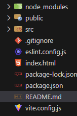
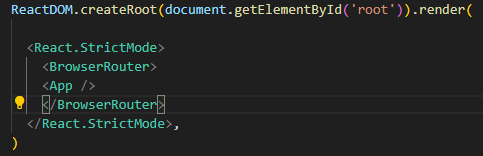
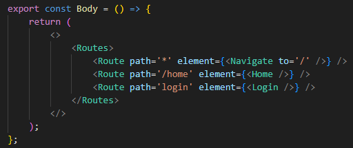

# Api Rick & Morty

Los pasos a seguir para interactuar con esta API son en primer lugar, instalar las dependencias con: 
npm create vite@latest 
npm install 

Con la instalación creamos una estructura de carpetas.

Crearemos carpetas adicionales para los componentes y las vistas. 
Con el comando: npm run dev, podremos acceder a un front básico desde el navegador, al que le daremos forma y funcionalidades. 
Para poder enlazar las rutas instalaremos React Router Dom con el comando npm i react-router-dom.  
Para configurar las rutas envolvemos en una entiqueta denominada BrowserRouter para englobar el archivo App. 
. 
despues crearemos nuestro componente para las rutas. 
 
En el alojaremos todas las rutas de nuestras vistas.