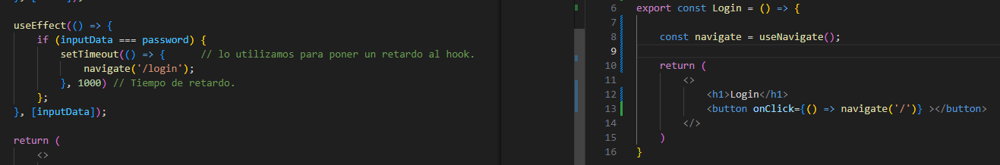
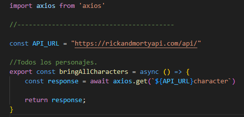
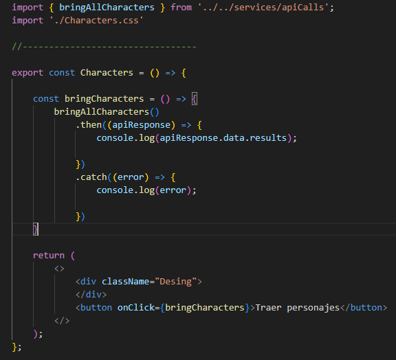

## Api Rick & Morty
# Tecnologías utilizadas:

    

Los pasos a seguir para interactuar con esta API son en primer lugar, instalar las dependencias con: 
npm create vite@latest 
npm install 

Con la instalación creamos una estructura de carpetas. 
 
Crearemos carpetas adicionales para los componentes y las vistas. 
Con el comando: npm run dev, podremos acceder a un front básico desde el navegador, al que le daremos forma y funcionalidades. 
Para poder enlazar las rutas instalaremos React Router Dom con el comando npm i react-router-dom.  
Para configurar las rutas envolvemos en una entiqueta denominada BrowserRouter el archivo App. 
. 
Despues crearemos nuestro componente para las rutas. 
 
En el alojaremos todas las rutas de nuestras vistas. Para poder movernos entre  vistas debemos instanciar el hook useNavigate. 
## Ejemplo.
 

Tambien instalaremos axios con npm i axios, para poder interactuar con cualquien back-end. Ya podremos crear las llamadas a la API 
## Ejemplo.
 
 

Una vez conseguimos setear los personajes podremos asignarles atributos como el nombre por ejemplo y mostrarlos en una lista ordenada.

## Estilo con Css

Le daremos estilo con css y haremos las vistas responsive antes de seguir profundizando en mas endpoints.

